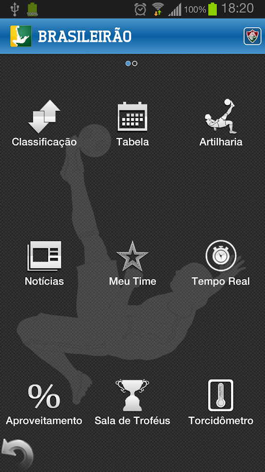
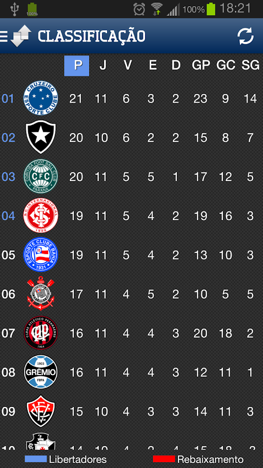
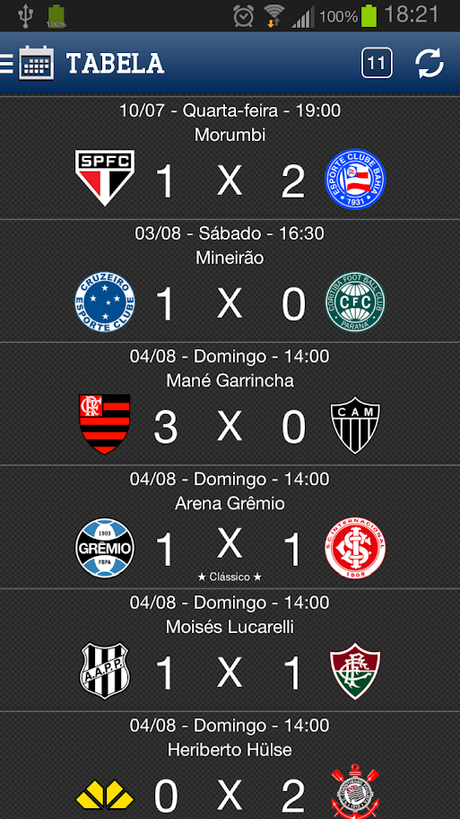
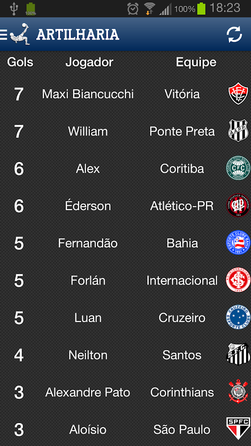
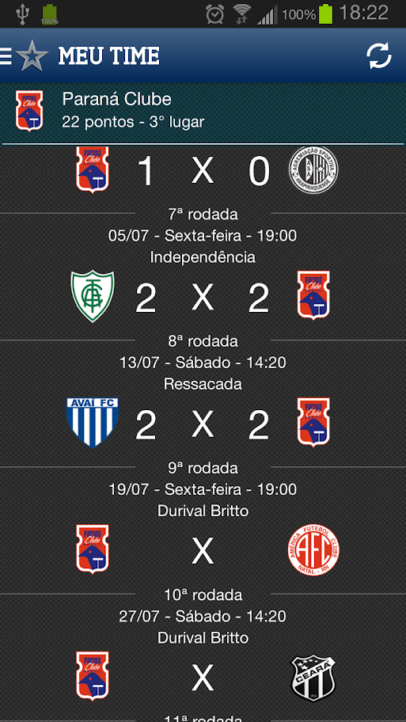
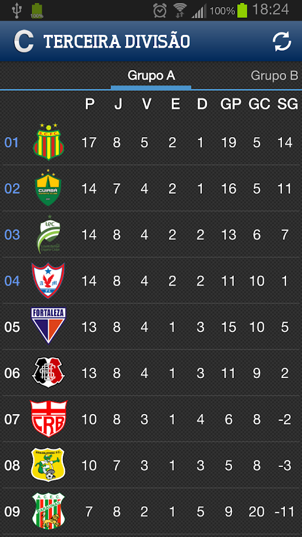
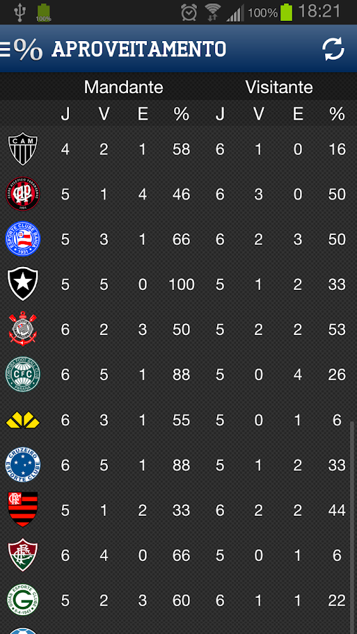

# Brasileirao 2012

Brasileirão, o aplicativo perfeito para você que não pode ficar sem as informações do campeonato de futebol mais disputado do mundo!
Siga a temporada do campeonato brasileiro em qualquer hora e lugar!

Com Brasileirão, você tem:
* Tabela de classificação (séries A, B e C)
* Tabela de jogos e resultados
* Artilharia
* Notícias de seu time sempre atualizadas
* Tempo real das partidas da série A e B
* Informações sobre as conquistas de todos os 40 clubes da série A e B
* Tabela de aproveitamento mandante/visitante
* Dados sobre os estádios onde são realizados os jogos

Tudo isso em uma interface moderna e bonita!

Baixe agora mesmo, e não perca um segundo do desenrolar do campeonato!

Informações em tempo real de seu time, seja ele da série A (Atlético-MG, Atlético-PR, Bahia, Botafogo, Corinthians, Coritiba, Criciúma, Cruzeiro, Flamengo, Fluminense, Goiás, Grêmio, Internacional, Náutico, Ponte Preta, Portuguesa, Santos, São Paulo, Vasco, Vitória), ou da série B (ABC, Asa de Arapiraca, América-MG, América-RN, Atlético-GO, Avaí, Boa Esporte, Bragantino, Ceará, Chapecoense, Figueirense, Guarani, Guaratinguetá, Icasa, Joinville, Oeste, Palmeiras, Paraná, Paysandu, São Caetano, Sport)!

- - - 

Screenshots:

|  |  |   |  |  |  |  |  |
|---|---|---|---|---|---|---|---|

- - - 

PERMISSÕES:

COMUNICAÇÃO DA REDE - ACESSO TOTAL À INTERNET
Permite que o aplicativo crie sockets de rede.

CHAMADAS TELEFÔNICAS - LER ESTADO E IDENTIDADE DO TELEFONE
Para utilizar o torcidômetro, é necessário ler o número de série do dispositivo, uma vez que é necessário um identificador único para cada android rodando o app.
Em nenhum momento os dados sobre chamadas ou mensagens são lidos pelo aplicativo.

CONTROLES DE HARDWARE - CONTROLAR A VIBRAÇÃO
Permite que o aplicativo controle a vibração.

COMUNICAÇÃO DA REDE - VER ESTADO DA REDE
Permite que o aplicativo visualize o estado de todas as redes conectadas ao dispositivo, como internet ou redes móveis (3G).

- - - 

Demonstração de algumas funcionalidades do aplicativo (requer Flash Player instalado): http://www.appdemostore.com/demo?id=1894029

- - - 

"O Campeonato Brasileiro só começa no dia 19, mas desde já você pode se preparar para não perder nenhum detalhe (...). O Brasileirão 2012 traz tabela, disputa pela artilharia, notícias e até aqueles índices malucos de aproveitamento para os quais só a galera que vê o Neto e o Denílson na hora do almoço dá bola."
- Gizmodo.com.br [http://bit.ly/KD8cLZ]

"O app 'Brasileirão 2012' deixa qualquer usuário de Android por dentro das informações do maior campeonato de futebol do país.
Com ele é possível acompanhar as classificações, jogos e resultados das séries A e B, com detalhes sobre artilharia, informações atualizadas de times, tabela de aproveitamento de mandante/ visitante e até dados dos estádios onde os jogos são realizados."
- Info Exame [http://bit.ly/Jy8nxZ]

"Com o Brasileirão 2012 no celular Android você tem acesso a todos os detalhes do Campeonato Brasileiro a qualquer hora e em qualquer lugar."
- Softonic [http://bit.ly/Kb6FAm]

- - - 

Presença na lista de "principais aplicativos gratuitos" em 21/05 e "Tendências" do Google Play, em 14/05
- [http://i48.tinypic.com/qwy808.png] e [http://i48.tinypic.com/24v4cci.png]
